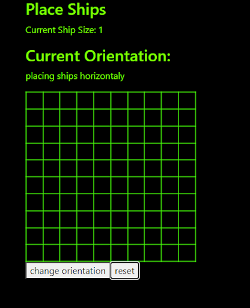
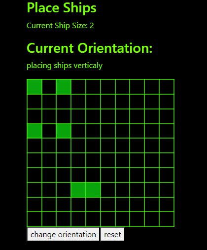

# Battleships Webapp

## Informacje o projekcie
> **Kurs**: Testowanie i Jakość Oprogramowania<br>
> **Autorzy**: 
> * Bartłomiej Gala - 35201
> * Piotr Dawid - 35195
> 
> **Temat projektu**: Gra w statki online<br>
> **Opis projektu**: Projekt zakłada implementację oraz testowanie serwera oraz aplikacji służącej do prowadzenia wieloosobowych rozgrywek w statki<br>

## Uruchamianie
Sekwencja komend służąca do uruchamiania poszczególnych animacji zaczyna się w katalogó głównym projektu.

### Serwer: 
```
> cd ./server
> npm run dev
```

### Frontend
``` 
> cd ./app/battleshipsFrontend
> ng serve
```

W konsoli pojawi się adres na którym dostępna jest aplikacja (zazwyczaj http://localhost:4200)

## Testy
Przed uruchomieniem testów ważne jest uruchomienie aplikacji

### Testy jednostkowe
### Testy integracyjne

### Testy manualne
| **ID** | TM_01 |
| --- | --- |
| **Tytuł** | Zabezpieczenie przed nieautoryzowanym dostępem |
| **Opis** | Niezalogowany użytkownik, niezależnie od wpisanego adresu aplikacji powinien zostać przekierowany na stronę logowania |
| **Warunki początkowe** | Użytkownik nie logował się do aplikacji (localstorage jest pusty) |
| **Kroki testowe** | 1. Wpisz adres http://localhost:4200 w pasku adresu przeglądarki |
| **Oczekiwany rezultat** | Użytkownik zostaje przekierowany do podstrony http://localhost:4200/login w celu zalogowania |

<br>

| **ID** | TM_02 |
| --- | --- |
| **Tytuł** | Logowanie z poprawnymi danymi |
| **Opis** | Posiadając poprawne dane użytkownik może się zalogować i uzyskać dostęp do aplikacji. |
| **Warunki początkowe** | Użytkownik posiada założone konto i znajduje się na ekranie logowania http://localhost:4200/login |
| **Kroki testowe** | 1. W polu Login wpisz test3 <br> 2. W polu Password wpisz pass<br> 3. Kliknij przycisk Log in|
| **Oczekiwany rezultat** |Przekierowanie na stronę domową http://localhost:4200/home |

<br>

| **ID** | TM_03 |
| --- | --- |
| **Tytuł** | Logowanie z błędnymi danymi danymi |
| **Opis** | W wypadku podania błędnych danych powinien zostać wyświetlony komunikat o nieudanej autoryzacji |
| **Warunki początkowe** | Nie Istnieje konto o nazwie no_name i haśle no_pass i użytkownik znajduje się na strpnie logowania http://localhost:4200/login |
| **Kroki testowe** | 1. W polu Login wpisz no_name<br> 2. W polu Password wpisz no_pass<br> 3. Kliknij przycisk Log in|
| **Oczekiwany rezultat** | Wyświetlenie komunikatu o treści “Login failed. Please try again” |

<br>

| **ID** | TM_04 |
| --- | --- |
| **Tytuł** | Próba utworzenia konta o istniejącej nazwie |
| **Opis** | W wypadku podjęcia próby stworzenia konta o nazwie która jest już zajęta, powinien zostać wyświetlony odpowiedni komunikat |
| **Warunki początkowe** | Użytkownik znajduje się na stronie rejestracji http://localhost:4200/register |
| **Kroki testowe** | 1. W polu Login wpisz test3 <br> 2. W polu Password wpisz haslo<br> 3. W polu Email wpisz test@mail.com <br> 4. Kliknij przycisk Sign up|
| **Oczekiwany rezultat** | Powinien zostać wyświetlony komunikat “Username is already taken, try different one” |

<br>

| **ID** | TM_05 |
| --- | --- |
| **Tytuł** |Utworzenie konta|
| **Opis** |W przypadku podania poprawnych danych konto ma zostać utworzone |
| **Warunki początkowe** | Nie istnieje konto o nazwie UserFinal, użytkownik znajduje się na ekranie rejestracji http://localhost:4200/register |
| **Kroki testowe** | 1. W polu Login wpisz UserFinal<br> 2. W polu Password wpisz haslo <br> 3. W polu Email wpisz test@mail.com<br> 4. Kliknij przycisk Sign up|
| **Oczekiwany rezultat** | Uzytkownik powinien zostać przeniesiony na ekran logowania http://localhost:4200/login, a podane wcześniej informacje powinny pozwolić na zalogowanie się (jak w przykładzie TM_02) |

<br>


| **ID** | TM_06 |
| --- | --- |
| **Tytuł** |Wylogowanie|
| **Opis** |W momencie wylogowania, użytkownik powinien zostać przeniesiony na ekran logowania |
| **Warunki początkowe** | Użytkownik jest zalogowany i znajduje się na stronie domowej. |
| **Kroki testowe** | 1. kliknij w przycisk Log Out |
| **Oczekiwany rezultat** | Użytkownik powinien zostać przeniesiony na ekran informujący o konieczności zalogowania http://localhost:4200/login. |

<br>

| **ID** | TM_07 |
| --- | --- |
| **Tytuł** | Sprawdzanie danych konta i powrót na stronę domową |
| **Opis** | Zalogowany użytkownik powinien móc sprawdzić swoje dane na ekranie Account i wrócić do ekranu domowego |
| **Warunki początkowe** | Użytkownik jest zalogowany i znajduje się na stronie domowej. |
| **Kroki testowe** | 1. kliknij w przycisk Your Account<br> 2. Sprawdź dane<br> 3. Kliknij w logo aplikacji |
| **Oczekiwany rezultat** | użytkownik powinien zostać przeniesiony na ekran z informacjami o jego koncie,a po kliknięciu w logo przeniesiony na ekran domowy. |

<br>

| **ID** | TM_08 |
| --- | --- |
| **Tytuł** | Sprawdzanie rankingu użytkowników |
| **Opis** | Zalogowany użytkownik powinien móc sprawdzić ranking użytkowników |
| **Warunki początkowe** | Użytkownik jest zalogowany i znajduje się na stronie domowej. |
| **Kroki testowe** | 1. kliknij w przycisk Ranking<br> 2. sprawdź dane<br> 3. kliknij w logo aplikacji |
| **Oczekiwany rezultat** | użytkownik powinien zostać przeniesiony na ekran z informacjami o jego koncie,a po kliknięciu w logo przeniesiony na ekran domowy. |

<br>

| **ID** | TM_09 |
| --- | --- |
| **Tytuł** | Rozpoczęcie Gry Singleplayer |
| **Opis** | Zalogowany użytkownik może  rozpocząć gra Singleplayer z przeciwnikiem komputerowym |
| **Warunki początkowe** |Użytkownik jest zalogowany i znajduje się na stronie domowej. |
| **Kroki testowe** | 1. kliknij w przycisk Singleplayer |
| **Oczekiwany rezultat** | użytkownik zostanie przeniesiony na ekran ustawiania statków |

<br>

| **ID** | TM_10 |
| --- | --- |
| **Tytuł** | Rozpoczęcie Gry Multiplayer  |
| **Opis** | Zalogowany użytkownik może rozpocząć grę Multiplayer z przeciwnikiem online |
| **Warunki początkowe** | Otwarte są dwie instancje aplikacji (najlepiej na dwóch różnych przeglądarkach lub w oknach prywatnych) a obu instancjach aplikacji, użytkownicy są zalogowani i znajdują się na stronie domowej http://localhost:4200/home |
| **Kroki testowe** | 1. Obydwaj użytkownicy klikają przycisk Multiplayer (w dowolnej kolejności) |
| **Oczekiwany rezultat** | Obaj użytkownicy trafiają na ekran wyszukiwania gry. Po chwili (gdy serwer znajdzie przeciwnika do gry), przenoszeni są na ekran ustawiania statków. |

<br>
<table style="width: 100%;">
    <tr>
        <th> <b>ID</b> </th>
        <th> TM_11 </th>
        <th style=" width: 35%"> Obraz pomocniczy </th>
    </tr>
    <tr>
        <td><b>Tytuł<b></td>
        <td>Udane ustawienie statku</td>
        <td rowspan="5"></td>
    </tr>
    <tr>
        <td><b>Opis<b></td>
        <td>Na ekranie ustawiania statków gracz może zgodnie z zasadami ustawić statki </td>
    </tr>
    <tr>
        <td><b>Warunki początkowe<b></td>
        <td>użytkownik znajduje się na ekranie ustawiania statków, Current Ship Size to 1 , Placing Ship to horizontally, plansza jest pusta (patrz obraz pomocniczy) </td>
    </tr>
    <tr>
        <td><b>Kroki testowe<b></td>
        <td>1. kliknij na komórkę [0][0] (1 wiersz 1 kolumna) </td>
    </tr>
    <tr>
        <td><b>Oczekiwany rezultat<b></td>
        <td>kolor komórki zmienia się na zielony, reprezentując ustawiony statek </td>
    </tr>    
</table>

<br>

| **ID** | TM_12 |
| --- | --- |
| **Tytuł** | Zmienianie  orientacji stawianego statku |
| **Opis** | Na ekranie ustawiania statków gracz może zmienić orientację ustawianego statku |
| **Warunki początkowe** | użytkownik znajduje się na ekranie ustawiania statków Placing Ship to horizontally |
| **Kroki testowe** | 1. kliknij przycisk Change Orientation  |
| **Oczekiwany rezultat** | Placing Ship  zmienia się na vertically, a następne ustawione statki będą pionowe (w dół od klikniętej komórki) |

<br>

| **ID** | TM_13 |
| --- | --- |
| **Tytuł** | Usuwanie obecnego ustawieia planszy |
| **Opis** | Gracz może usunąć postawione statki i zacząć rozstawianie od nowa |
| **Warunki początkowe** | użytkownik znajduje się na ekranie ustawiania statków, kilka staków jest już ustaione |
| **Kroki testowe** | 1. kliknij przycisk Reset  |
| **Oczekiwany rezultat** | Plansza staje się pusta i gracz może na nowo rozstawiać statki |

<br>

| **ID** | TM_14 |
| --- | --- |
| **Tytuł** | Ustawienie statku poza granicami planszy |
| **Opis** | W przypadku próby ustawienia statku w sposób, który oznaczałby że pola statku znajdowałyby się poza planszą, powinna zakończyć się niepowodzeniem. |
| **Warunki początkowe** |Ustawione zostały cztery statki o rozmiarze 1 na lewej krawędzi ekranu tak aby się nie stykały, Current Ship Size jest równe 2 a placing ships ma wartość horizontally.|
| **Kroki testowe** | 1. Kliknąć skrajnie prawą komórkę pierwszego wiersza.  |
| **Oczekiwany rezultat** | Na planszy nie powinien pojawić się statek ponieważ wykraczał by on poza granice planszy. |

<br>
<table style="width: 100%;">
    <tr>
        <th> <b>ID</b> </th>
        <th> TM_15 </th>
        <th style="width: 35%"> Obraz pomocniczy </th>
    </tr>
    <tr>
        <td><b>Tytuł<b></td>
        <td>Ustawienie statku nachodzącego na istniejący</td>
        <td rowspan="5"></td>
    </tr>
    <tr>
        <td><b>Opis<b></td>
        <td>W przypadku próby ustawienia statku w sposób, który oznaczał by że pola statku nachodziły by na inny statek, powinna zakończyć się niepowodzeniem.</td>
    </tr>
    <tr>
        <td><b>Warunki początkowe<b></td>
        <td>Statki ustawione w sposób widoczny na zdjęciu, Current Ship Size jest równe 2 a placing ships ma wartość vertically.</td>
    </tr>
    <tr>
        <td><b>Kroki testowe<b></td>
        <td>1. Kliknąć komórkę znajdującą się piątej kolumnie i siódmym wierszu. </td>
    </tr>
    <tr>
        <td><b>Oczekiwany rezultat<b></td>
        <td>Na planszy nie powinien pojawić się statek ponieważ nachodziłby on na postawiony wcześniej statek</td>
    </tr>    
</table>
<br>
<table style="width: 100%;">
    <tr>
        <th> <b>ID</b> </th>
        <th> TM_16 </th>
        <th style="width: 35%"> Obraz pomocniczy </th>
    </tr>
    <tr>
        <td><b>Tytuł<b></td>
        <td>Ustawienie statku stykającego się z innym</td>
        <td rowspan="5"></td>
    </tr>
    <tr>
        <td><b>Opis<b></td>
        <td>W przypadku próby ustawienia statku w sposób, który oznaczałby że pola statku stykają się polami innego staku powinno zakończyć się niepowodzeniem.</td>
    </tr>
    <tr>
        <td><b>Warunki początkowe<b></td>
        <td>Statki ustawione w sposób widoczny na zdjęciu, Current Ship Size jest równe 2 a placing ships ma wartość vertically.</td>
    </tr>
    <tr>
        <td><b>Kroki testowe<b></td>
        <td>1. Kliknąć komórkę znajdującą się szóstej kolumnie i szóstym wierszu.</td>
    </tr>
    <tr>
        <td><b>Oczekiwany rezultat<b></td>
        <td>Na planszy nie powinien pojawić się statek ponieważ dotykałby on innego statku.</td>
    </tr>    
</table>
<br>

| **ID** | TM_17|
| --- | --- |
| **Tytuł** | Udane oddawanie strzału |
| **Opis** | W grze gracz może w swojej turze strzelić pole wroga jeśli nie strzelił w nie wcześniej, ani nie zniszczył statku sąsiadującego z tym polem |
| **Warunki początkowe** |Gracz znajduje się na ekranie rozgrywki, jest jego tura. pole w 1 wierszu 3 kolumnie nie było wcześniej ostrzelane, ani nie sąsiaduje ze zniszczonym już statkiem(jest czarne). Jest tura gracza|
| **Kroki testowe** | 1. kliknij pole w 1 wierszu 3 kolumnie.  |
| **Oczekiwany rezultat** | Kolor pola zmienia się na czerwony jeśli trafiono statek wroga, lub niebieski jeśli nie trafiono statku, tura przechodzi na przeciwnika. |

<br>

| **ID** | TM_18|
| --- | --- |
| **Tytuł** | Próba strzału w turze wroga |
| **Opis** | W grze gracz nie może strzelić w żadne pole w turze wroga |
| **Warunki początkowe** | Gracz znajduje się na ekranie rozgrywki, jest tura wroga. |
| **Kroki testowe** | 1. kliknij pole w 2 wierszu 7 kolumnie. |
| **Oczekiwany rezultat** | Nic się nie dzieje. |

<br>

| **ID** | TM_19|
| --- | --- |
| **Tytuł** | Próba strzału we wcześniej strzelone pole |
| **Opis** | Gracz nie może strzelać w to samo pole wielokrotnie |
| **Warunki początkowe** | Gracz znajduje się na ekranie rozgrywki, gracz wykonał co najmniej jeden ruch, jest tura gracza |
| **Kroki testowe** | 1. Kliknij we wcześniej trafione pole (oznaczone na niebiesko lub czerwono) |
| **Oczekiwany rezultat** | Nic się nie dzieje. |

<br>

| **ID** | TM_20 |
| --- | --- |
| **Tytuł** | Koniec rozgrywki |
| **Opis** | Gdy wszystkie statki jednego z graczy są zniszczone, pojawia się komunikat o wyniku, oraz przycisk powrotu do menu |
| **Warunki początkowe** |Gracz znajduje się na ekranie rozgrywki, jest jego tura, przeciwnik ma 1 nie zestrzelone pole statku |
| **Kroki testowe** | 1. kliknij pole zawierające ostatnie pole statku wroga |
| **Oczekiwany rezultat** | Gracz przenosi się na ekran końca gry z informacją o jego zwycięstwie |

<br>

## Technologia
Technologie użyte w projekcie to:
* Anguar + TypeScript (frontend)
* ExpressJS + TypeScipt (backend)
* PostgreSQL (baza danych)

## Opis API
API dla serwera dzieli się na dwie części:
* API REST - do podstawowej komunikacji z serwerem (logowanie, pobieranie rankingów etc.)
* WebSocket - w celu komunikacji w czasie rzeczywistym (rozgrywka)

### REST

#### Logowanie i autoryzacja
<details>
 <summary><code>POST</code> <code><b>/api/session/create</b></code> - Logowanie do aplikacji</summary>

##### Parametry zapytania

> Brak

##### Parametry body
> | Nazwa   |  wymagany      | typ      | opis                                          |
> |-|-|--|-|
> | `name` |  tak  | string | Nazwa użytkownika |
> | `password` |  tak  | string | hasło użytkownika |
Example JSON:
```json
{
    "name": "string",
    "password": "string"
}
```

##### Odpowiedzi

> | kod HTTP    | content-type | odpowiedź |
> |-|-|-|
> | `201` | `application/json` | `{"token": ""}` |
> | `401` | `text/html;charset=utf-8` | `Invalid Password` |
> | `500` | `text/html;charset=utf-8` | ` Unknown Error ` |

</details>
<details>
 <summary><code>POST</code> <code><b>/api/session/delete</b></code> - Wylogowywanie z aplikacji</summary>

##### Parametry zapytania

> Brak

##### Parametry body

> Brak

##### Nagłówki zapytania

> | Nazwa nagłówka | zawartość | Opis |
> |-|-|-|
> |`Authorization` | `Bearer: `| Nagłówek zawierający token JWT |

##### Odpowiedzi

> | kod HTTP    | content-type | odpowiedź |
> |-|-|-|
> | `400` | `text/html;charset=utf-8` | `Token Missing` |
> | `200` | `text/html;charset=utf-8` | Brak |

</details>

<details>
 <summary><code>POST</code> <code><b>/api/session/game/create</b></code> - Autoryzacja sesji WebSocket</summary>

##### Parametry zapytania

> Brak

##### Parametry body

> Brak

##### Nagłówki zapytania

> | Nazwa nagłówka    | zawartość | Opis |
> |-|-|-|
> |`Authorization` | `Bearer: `| Nagłówek zawierający token JWT |


##### Odpowiedzi

> | kod HTTP    | content-type | odpowiedź |
> |-|-|-|
> | `401` | `text/html;charset=utf-8` | `Token Missing` |
> | `201` | `application/json` | `{"sessionKey": "sessionKey"}`|

</details>

#### Zarządzanie kontem

<details>
 <summary><code>POST</code> <code><b>/api/users/create</b></code> - Utworzenie konta użytkownika</summary>

##### Parametry zapytania

> Brak

##### Parametry body
> | Nazwa |  wymagany | typ  | opis  |
> |-|-|--|-|
> | `name` |  tak  | string | Nazwa użytkownika |
> | `email` |  tak  | string | Adres Email użytkownika |
> | `password` |  tak  | string | Hasło użytkownika |
Example JSON:
```json
{
    "name": "string",
    "email": "test@mail.com",
    "password": "string"
}
```

##### Odpowiedzi

> | kod HTTP    | content-type | odpowiedź |
> |-|-|-|
> | `201` | `application/json` | Brak|
> | `400` | `text/html;charset=utf-8` | `Invalid data format` |
> | `400` | `text/html;charset=utf-8` | `Name already in use` |
> | `500` | `text/html;charset=utf-8` | `Failed to create user` |

</details>
<details>
 <summary><code>PATCH</code> <code><b>/api/users/user/{name}/update</b></code> - Aktualizacja danych konta użytkownika</summary>

##### Parametry zapytania

> | Nazwa |  wymagany | typ  | opis  |
> |-|-|--|-|
> | `name` |  tak  | string | Nazwa użytkownika |

##### Parametry body
> | Nazwa |  wymagany | typ  | opis  |
> |-|-|--|-|
> | `email` |  nie  | string | Nowy adres email |
> | `password` |  nie  | string | Nowe hasło |

Example JSON:
```json
{
    "password": "string",
    "email": "string@mail.com",
}
```

##### Odpowiedzi

> | kod HTTP    | content-type | odpowiedź |
> |-|-|-|
> | `201` | `application/json` | `{"sessionKey": "sessionKey"}`|
> | `404` | `text/html;charset=utf-8` | `No such user` |
> | `403` | `text/html;charset=utf-8` | `Action is forbidden` |
> | `400` | `text/html;charset=utf-8` | `Invalud Email` |

</details>
<details>
 <summary><code>POST</code> <code><b>/api/session/game/create</b></code> - Autoryzacja sesji WebSocket</summary>

##### Parametry zapytania

> Brak

##### Parametry body
> | Nazwa |  wymagany | typ  | opis  |
> |-|-|--|-|
> | `session` |  tak  | string | token JWT |
Example JSON:
```json
{
    "session": "string",
}
```

##### Odpowiedzi

> | kod HTTP    | content-type | odpowiedź |
> |-|-|-|
> | `401` | `text/html;charset=utf-8` | `Token Missing` |
> | `201` | `application/json` | `{"sessionKey": "sessionKey"}`|

</details>
<details>
 <summary><code>POST</code> <code><b>/api/session/game/create</b></code> - Autoryzacja sesji WebSocket</summary>

##### Parametry zapytania

> Brak

##### Parametry body
> | Nazwa |  wymagany | typ  | opis  |
> |-|-|--|-|
> | `session` |  tak  | string | token JWT |
Example JSON:
```json
{
    "session": "string",
}
```

##### Odpowiedzi

> | kod HTTP    | content-type | odpowiedź |
> |-|-|-|
> | `401` | `text/html;charset=utf-8` | `Token Missing` |
> | `201` | `application/json` | `{"sessionKey": "sessionKey"}`|

</details>
<details>
 <summary><code>POST</code> <code><b>/api/session/game/create</b></code> - Autoryzacja sesji WebSocket</summary>

##### Parametry zapytania

> Brak

##### Parametry body
> | Nazwa |  wymagany | typ  | opis  |
> |-|-|--|-|
> | `session` |  tak  | string | token JWT |
Example JSON:
```json
{
    "session": "string",
}
```

##### Odpowiedzi

> | kod HTTP    | content-type | odpowiedź |
> |-|-|-|
> | `401` | `text/html;charset=utf-8` | `Token Missing` |
> | `201` | `application/json` | `{"sessionKey": "sessionKey"}`|

</details>
<details>
 <summary><code>POST</code> <code><b>/api/session/game/create</b></code> - Autoryzacja sesji WebSocket</summary>

##### Parametry zapytania

> Brak

##### Parametry body
> | Nazwa |  wymagany | typ  | opis  |
> |-|-|--|-|
> | `session` |  tak  | string | token JWT |
Example JSON:
```json
{
    "session": "string",
}
```

##### Odpowiedzi

> | kod HTTP    | content-type | odpowiedź |
> |-|-|-|
> | `401` | `text/html;charset=utf-8` | `Token Missing` |
> | `201` | `application/json` | `{"sessionKey": "sessionKey"}`|

</details>
<details>
 <summary><code>POST</code> <code><b>/api/session/game/create</b></code> - Autoryzacja sesji WebSocket</summary>

##### Parametry zapytania

> Brak

##### Parametry body
> | Nazwa |  wymagany | typ  | opis  |
> |-|-|--|-|
> | `session` |  tak  | string | token JWT |
Example JSON:
```json
{
    "session": "string",
}
```

##### Odpowiedzi

> | kod HTTP    | content-type | odpowiedź |
> |-|-|-|
> | `401` | `text/html;charset=utf-8` | `Token Missing` |
> | `201` | `application/json` | `{"sessionKey": "sessionKey"}`|

</details>
<details>
 <summary><code>POST</code> <code><b>/api/session/game/create</b></code> - Autoryzacja sesji WebSocket</summary>

##### Parametry zapytania

> Brak

##### Parametry body
> | Nazwa |  wymagany | typ  | opis  |
> |-|-|--|-|
> | `session` |  tak  | string | token JWT |
Example JSON:
```json
{
    "session": "string",
}
```

##### Odpowiedzi

> | kod HTTP    | content-type | odpowiedź |
> |-|-|-|
> | `401` | `text/html;charset=utf-8` | `Token Missing` |
> | `201` | `application/json` | `{"sessionKey": "sessionKey"}`|

</details>